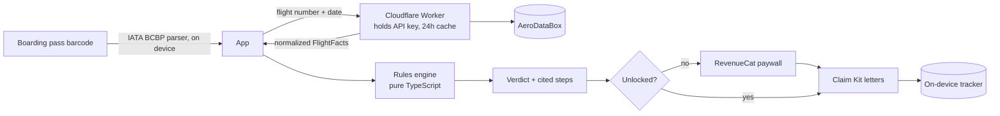

# RefundDrop

**Claim what airlines owe you — and keep all of it.**


Scan your boarding pass. RefundDrop pulls your flight's real arrival time, applies EU261, UK261 or US DOT refund rules step by step, and tells you honestly whether you're owed money — citing the law behind every step. If you are, it writes the claim, the follow-up and the regulator complaint for you, so you don't hand 25–50% of your payout to a claim company.

> Built for the RevenueCat **Shipaton 2026 Next Gen Award**.

## Why it exists

Airlines owe passengers €250–€600 for long delays, short-notice cancellations and overbooking on European flights, yet most eligible passengers never claim. The ones who do usually go through claim companies that keep around a third of the money. The eligibility check itself is simple once the rules are encoded — so RefundDrop gives the check away and charges a small, flat fee for the part that actually saves people money: a claim that cites the right rules and a process that doesn't give up after one email.

## What it does

| Step | What happens |
| --- | --- |
| **Scan** | Reads the IATA barcode on any paper or mobile boarding pass (PDF417, Aztec, QR) — flight, date, name and booking reference, fully offline |
| **Look up** | Fetches scheduled vs actual arrival and the operating airline via AeroDataBox (through a key-hiding proxy) |
| **Ask** | Only what data can't know: connections, the cause the airline gave, cancellation notice, replacement flight, overbooking |
| **Verdict** | *Likely*, *possibly*, *refund only*, *not eligible* or *not covered* — with every rule it applied, what's still unconfirmed, and other rights (meals, hotels, refunds) |
| **Claim Kit** | Claim letter, day-14 follow-up and escalation to the right national enforcement body; copy, share or PDF |
| **Track** | On-device tracker: Drafted → Sent → Replied → Paid, with follow-up reminders |

## Monetization (RevenueCat)

| Product | Type | Price | Unlocks |
| --- | --- | --- | --- |
| `claim_kit` | One-time | $4.99 | Claim Kit for one flight |
| `frequent_flyer_annual` | Subscription (`pro` entitlement) | $19.99/yr | Every flight |

- The eligibility check is **always free** — trust is the funnel, and people claim rarely, so per-claim pricing matches how they actually use it. Frequent travellers get the subscription.
- The paywall shows the real comparison for *their* flight: a claim company's ~35% fee vs $4.99.
- Claim Kit purchases are counted from RevenueCat's non-subscription transactions, so each purchase is one credit that survives reinstalls via **Restore purchases**. The flight a credit was spent on is remembered on-device.
- Running the open-source repo without a RevenueCat key switches to a clearly-labelled **demo mode** so anyone can explore the full flow.

## What makes it different

- **Honest output.** Never "you are owed". An unknown cause gives "possibly eligible" and a letter that asks the airline to state and prove it. Bad weather gives a clear *no*.
- **Explainable.** Every verdict lists its steps with the article or court ruling behind each (Sturgeon, Wallentin-Hermann, Airhelp v SAS, Folkerts…).
- **Deterministic.** Eligibility comes from a pure, tested TypeScript rules engine — not an AI model.
- **Versioned rules.** Thresholds and amounts live in `src/rules/config.ts`, so the EU261 reform expected in 2027 is a config change.
- **Private.** Claims and scanned details stay on the phone.

## Rules covered

| Situation | Rule |
| --- | --- |
| Which regime applies (departure airport, destination, operating airline's licence) | EU261 / UK261 Art. 3 |
| Arrival delay of 3h+, measured at the final destination | CJEU Sturgeon, Germanwings, Folkerts |
| Distance bands €250 / €400 / €600 (£220 / £350 / £520), great-circle, intra-EU cap | Art. 7(1), 7(4) |
| 50% reduction for long-haul 3–4h delays and close reroutes | Art. 7(2) |
| Cancellations: 14-day notice rule and replacement-flight allowances | Art. 5(1)(c) |
| Extraordinary circumstances vs airline-controlled causes | Art. 5(3); Wallentin-Hermann; Airhelp v SAS |
| Denied boarding, voluntary vs involuntary | Art. 4 |
| Connections on one booking vs separate tickets | Art. 2(h); Folkerts |
| Codeshares: claim from the operating airline | Art. 3(5) |
| US: cash refund if significantly delayed (3h domestic / 6h international) or cancelled and you didn't travel | 14 CFR 260 |

The US has no federal cash compensation for delays — DOT withdrew that proposal in November 2025 — so US flights get refund guidance only.

## Architecture



The app never holds the flight-data API key, so the repository can stay public. Sample flight numbers and the sample boarding pass resolve on-device, so the demo works offline.

## Project layout

```
src/app/            Screens (Expo Router): intro, lookup, scan, flight, questions,
                    verdict, paywall, kit, claims, letter
src/rules/          Rules engine (pure TypeScript, no React)
  types.ts          Inputs and verdict types
  config.ts         Versioned thresholds and amounts
  engine.ts         Scope → disruption → amount → verdict
  geo.ts            Regions and great-circle distance
  reference.ts      Airports and airline licences
src/claim/          Claim, follow-up and escalation letter templates
src/services/       Flight lookup, AeroDataBox normalizer, boarding-pass parser, RevenueCat
src/state/          Flow state, claim tracker, entitlements
src/data/           Sample flights and sample boarding pass
worker/             Cloudflare Worker proxy
tests/              Vitest suite (73 tests)
docs/               Sample boarding pass for demos
```

## Run it

You need [Node.js LTS](https://nodejs.org) and [Git](https://git-scm.com).

```bash
git clone https://github.com/sam16448/refunddrop.git
cd refunddrop
npm install
npm test            # 73 tests: rules engine, letters, boarding passes, API normalizer
npx expo start      # opens in Expo Go (purchases run in RevenueCat preview mode)
```

No keys are needed: tap a sample flight, or **Scan boarding pass → Try a sample boarding pass**. You can also scan [`docs/sample-boarding-pass.png`](docs/sample-boarding-pass.png) from your screen.

### Real purchases (RevenueCat Test Store)

1. Create a RevenueCat project with products `claim_kit` and `frequent_flyer_annual`, entitlement `pro`, and a `default` offering containing both.
2. Put the Test Store key in `.env`: `EXPO_PUBLIC_REVENUECAT_API_KEY=test_...`
3. Build a development client (purchases need native code): `npx eas-cli build --profile development --platform android`, install the APK, then `npx expo start`.

### Live flight data (optional)

1. Subscribe to the free AeroDataBox plan on RapidAPI.
2. Deploy the proxy:
   ```bash
   cd worker
   npm install
   npx wrangler login
   npx wrangler secret put RAPIDAPI_KEY
   npx wrangler deploy
   ```
3. Add `EXPO_PUBLIC_FLIGHT_PROXY_URL=<your worker URL>` to `.env` and restart.

## Sample data

The four sample flights use realistic routes and schedules with **invented** disruptions, chosen to show each rule path: a long-haul EU delay (€600), a short-notice EU cancellation (€250), a US domestic delay (refund only) and a non-European airline flying into the UK (not covered). The sample boarding pass is for a fictional passenger and is marked "not valid for travel".

## Disclaimer

RefundDrop gives general information based on published passenger-rights rules. It is not legal advice. Final eligibility depends on facts the airline must confirm, such as the cause of the disruption.

## License

[MIT](LICENSE)
